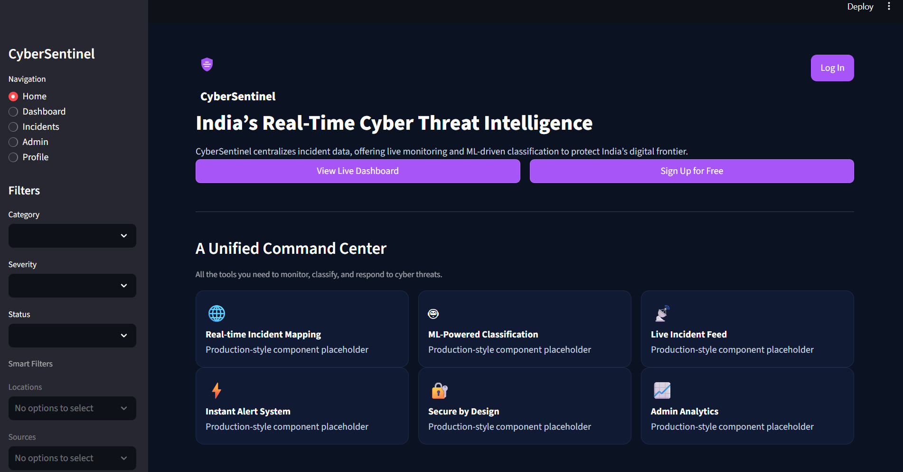
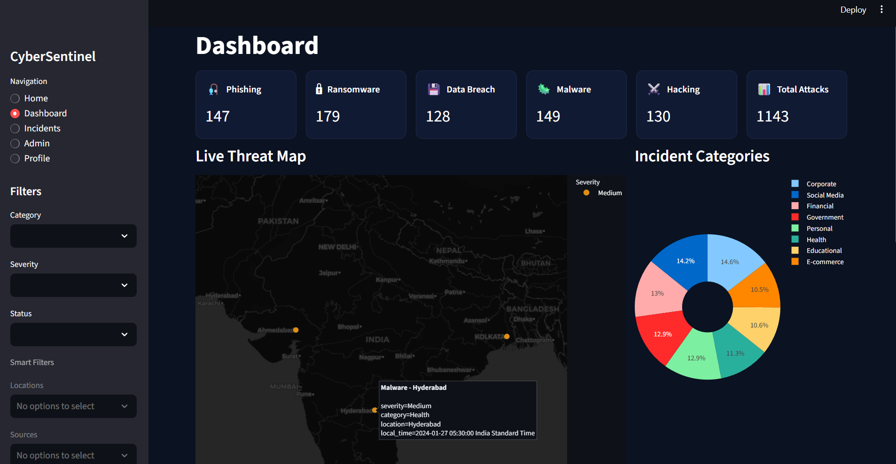

# CyberSentinel: India’s Cyber Incident Monitoring Dashboard

CyberSentinel is a full-stack cybersecurity monitoring dashboard focused on **Indian cyber incident data**.  
It combines a **FastAPI** backend with a **Streamlit** frontend to give security teams a single pane of glass for:

- Exploring recent and historical incidents  
- Monitoring geographic hot spots across Indian cities  
- Tracking categories, severities, and trends over time  
- Experimenting with ML-based anomaly detection and threat scoring  

The project is designed to be:

- **Easy to run locally** (CSV fallback, no database required)
- **Production-friendly** (optional MongoDB and Docker support)
- **Extensible** for new data sources, analytics, and visualizations

---

## Screenshots

> Save your screenshots into a `docs/` folder in the repo (for example `docs/home.png` and `docs/dashboard.png`) or adjust the paths below to wherever you store them.

### Home / Landing Page



### Dashboard View



---

## Key Features

- **Live Incident Dashboard**
  - Filterable incident table (category, severity, status, location, time range)
  - Summary cards for phishing, ransomware, data breach, malware, hacking, and total incidents

- **India-Focused Threat Map**
  - Interactive map centered on India using Plotly
  - City-level clustering and hover details (city, counts, severity mix)
  - Built-in geocoder and cache for common Indian cities

- **Standardized REST API**
  - `/api/incidents/` for listing and filtering incidents
  - `/api/insights/` endpoints for top locations and trend analytics
  - CSV fallback mode so you can work without MongoDB

- **Analytics & Insights**
  - Top locations by incident volume
  - Time-series trends of incidents over months/years
  - Category and severity distributions for quick situational awareness

- **Health & Observability**
  - `/health` and `/api/health` for readiness/liveness checks
  - Admin / status area in the dashboard showing backend health and config

- **ML-Ready Architecture**
  - Isolation Forest-based anomaly detection pipeline
  - Clean separation between data loading, feature engineering, and modeling
  - Ready to plug in more advanced models in `backend/ml/`

---

## Tech Stack

- **Backend**
  - Python, FastAPI
  - Optional MongoDB for persistent storage (with CSV fallback)
  - Pydantic models and typed schemas

- **Frontend**
  - Streamlit dashboard
  - Plotly for geospatial visualizations
  - Altair / Streamlit charts for summaries and trends

- **Data & ML**
  - CSV-based primary dataset of Indian cyber incidents
  - Custom geocoding with JSON cache
  - Isolation Forest model and feature pipeline

- **Tooling & Testing**
  - pytest, fastapi.testclient
  - GitHub Actions CI (tests and basic checks)

---

## Project Structure

```text
CyberSentinel-main/
  backend/
    app.py                  # FastAPI application entrypoint
    routers/
      incidents.py          # /api/incidents endpoints (CSV + Mongo)
      health.py             # /health and /api/health
      insights.py           # /api/insights (top locations, trends, etc.)
      detection.py          # ML / anomaly detection endpoints
    utils/
      geocode.py            # City → lat/lon geocoder + cache
    ml/                     # Isolation Forest model & feature pipeline
    models/                 # Pydantic models
    db/
      mongo.py              # Optional MongoDB connection helper
    data/
      cybersecurity_cases_india_combined.csv  # Primary incidents dataset
      geocode_cache.json    # Persistent geocode cache
    tests/                  # Backend unit + integration tests

  frontend/
    app.py                  # Streamlit dashboard

  scripts/
    run_services.py         # Simple runner (backend + frontend)
    service_manager.py      # Advanced Python-only service manager

  README.md
  Dockerfile                # Combined app Dockerfile
```

---

## Data Model & Incident Volume

The main dataset lives in:

- `backend/data/cybersecurity_cases_india_combined.csv`

It contains around **1200 rows** of Indian cyber incidents with fields like:

- `Year`
- `Day`
- `Amount_Lost_INR`
- `Incident_Type`
- `City`
- `Category`

The backend’s CSV loader:

1. Reads the CSV into memory.  
2. Skips rows without a valid city (needed for geocoding/map).  
3. Normalizes each row into a standard incident schema (id, type, category, timestamp, location, severity, etc.).  
4. Derives timestamps from Year + Day.  
5. Deduplicates incidents by `(type, timestamp, location)`.  

After cleaning and deduplication, the API typically serves **~1140–1150 incidents**, which is **expected** and validated by the test suite.

---

## Getting Started

### Prerequisites

- Python **3.10+**
- (Optional) MongoDB if you want persistent storage instead of CSV-only mode

> You do **not** need MongoDB for local development. If Mongo is unavailable, the backend automatically falls back to the CSV dataset.

### 1. Clone the Repository

```bash
git clone https://github.com/<your-username>/CyberSentinel.git
cd CyberSentinel-main/CyberSentinel-main
```

### 2. Create and Activate a Virtual Environment

**Windows (PowerShell)**

```powershell
python -m venv .venv
.\.venv\Scripts\Activate.ps1
```

**macOS / Linux**

```bash
python -m venv .venv
source .venv/bin/activate
```

### 3. Install Backend Dependencies

```bash
pip install -r backend/requirements.txt
```

---

## Running the App (Recommended)

From the project root (`CyberSentinel-main/CyberSentinel-main`), with the virtualenv active:

```bash
python scripts/run_services.py
```

This will:

- Start the FastAPI backend at `http://127.0.0.1:8000`
- Start the Streamlit dashboard at `http://localhost:8501`
- Wire the frontend’s `API_URL` to the backend automatically

Then open the dashboard in your browser:

```text
http://localhost:8501
```

Keep this terminal open while you use the app. Press `Ctrl+C` to stop both services.

---

## Running Components Separately

### Backend Only

```bash
# From project root, with venv active
python -m uvicorn backend.app:app --host 127.0.0.1 --port 8000 --reload
```

Health check:

```text
GET http://127.0.0.1:8000/health
```

### Frontend Only

If the backend is already running:

```bash
# From project root, with venv active
streamlit run frontend/app.py --server.port 8501
```

By default, the frontend will try to reach:

- `API_URL` env var, else  
- `BACKEND_URL` env var, else  
- `http://localhost:8000`

You can override the backend URL, for example:

```bash
# PowerShell
$env:API_URL="http://127.0.0.1:8000"

# bash / zsh
export API_URL="http://127.0.0.1:8000"
```

---

## Configuration

Most local setups work out of the box. Important knobs:

- **CORS origins** (`CORS_ORIGINS`):
  - Defaults to `http://localhost:8501` and `http://127.0.0.1:8501`.
- **Backend URL for the frontend**:
  - `API_URL` or `BACKEND_URL` environment variables.
  - When not running inside Docker, Docker-style hosts like `api:8000` are automatically rewritten to `http://localhost:8000`.
- **MongoDB (optional)**:
  - See `backend/db/mongo.py` for connection details and environment variables.
  - When MongoDB is not reachable, the service gracefully falls back to CSV mode.

You can also create a `.env` file in the project root to override defaults.  
The frontend will load `.env` from the repo root or from `frontend/` if present.

---

## Testing

From the project root, with the virtualenv active:

```bash
pytest
```

This runs:

- Geocoding tests (`backend/tests/test_geocode.py`)
- Health endpoint tests (`backend/tests/test_health.py`)
- Incident behavior tests (`backend/tests/test_incidents_recent.py`)
- Insights / ETag behavior tests (`backend/tests/test_insights.py`)
- Integration smoke test (`backend/tests/test_integration_smoke.py`) – **skipped by default**

To run the integration smoke test (requires a running backend on `127.0.0.1:8000`):

```bash
# Start backend in another terminal, then:
RUN_INTEGRATION=1 pytest backend/tests/test_integration_smoke.py
```

On success you should see something similar to:

```text
7 passed, 1 skipped
```

---

## How It Works (High-Level Flow)

1. **Data ingestion**
   - Load incidents from `cybersecurity_cases_india_combined.csv` (or MongoDB when configured).
   - Normalize each row into a consistent incident schema.

2. **Backend API**
   - `/api/incidents/` exposes filtered lists of incidents with pagination/limit.
   - `/api/insights/` exposes top locations and time-series aggregates.
   - `/health` and `/api/health` report service status for monitoring.

3. **Geocoding & enrichment**
   - `backend/utils/geocode.py` maps city names to latitude/longitude.
   - Results are cached in `geocode_cache.json` to avoid repeated lookups.

4. **ML & Detection**
   - `backend/ml/` contains an Isolation Forest-based anomaly detection pipeline.
   - Features are engineered from incident attributes (amount, category, time, etc.).

5. **Frontend dashboard**
   - Streamlit app fetches incidents and insights from the backend.
   - Renders summary cards, maps, charts, and admin/health views.

---

## Roadmap / Ideas

- Expand geocoding coverage beyond the curated city list.
- Plug in a production MongoDB deployment for persistent storage.
- Extend the ML module with additional models and explainability tools.
- Add authentication and role-based access control for admin-only views.
- Add Docker Compose stack (API + DB + frontend) for local and staging environments.

---

## License

Add your license here (e.g. MIT, Apache 2.0).

---

## Who Is This For?

- **Security analysts / SOC teams**: Quickly scan India-focused incidents, spot hot spots, and prioritize which cases to look at first using ML-backed anomaly scores.
- **Students and learners**: Explore a realistic, end‑to‑end cyber analytics stack (API, dashboard, ML) without needing cloud infrastructure.
- **Builders and researchers**: Fork and extend the platform with new data feeds, scoring models, or visualizations tailored to your own use cases.

---

## About the Developer

CyberSentinel is built and maintained by **Jahnavi**, with a focus on making **India‑centric cyber incident data** more accessible and actionable for learners and practitioners.

The goal of this project is to:

- Practice production‑style Python, APIs, and dashboards.
- Showcase an end‑to‑end security analytics workflow (data → API → ML → UI).
- Provide a solid foundation for future work in threat intelligence and SOC tooling.

If you have ideas, feedback, or want to collaborate, feel free to open an issue or a pull request on the GitHub repo.
